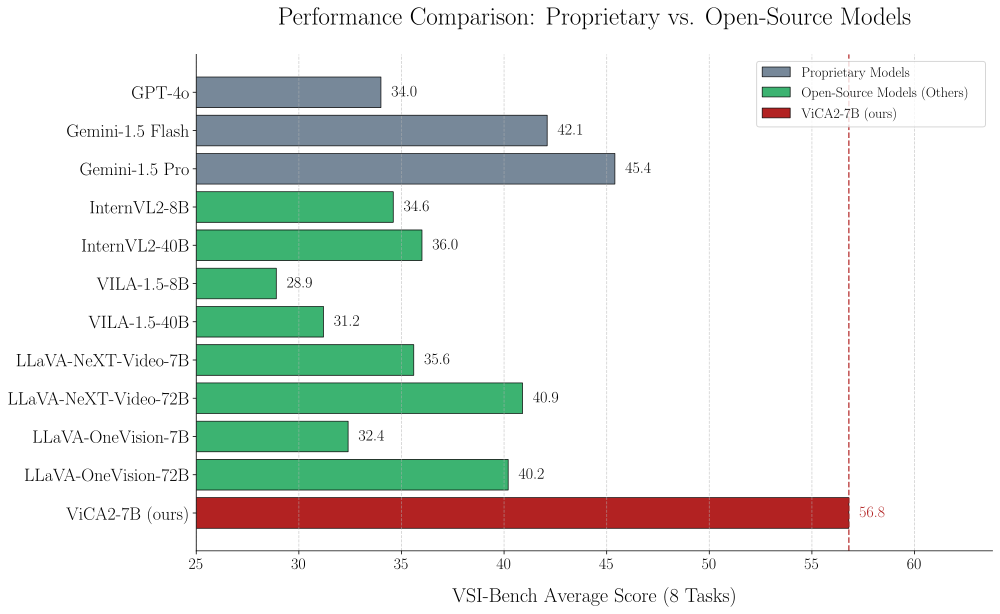
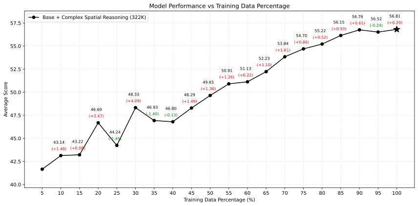

# ViCA2: Enhancing Visuospatial Cognition in Multimodal Large Language Models


[](https://huggingface.co/nkkbr/ViCA2)
[](https://huggingface.co/collections/nkkbr/vica2-68175b045c2407a800910b06)

[](https://huggingface.co/datasets/nkkbr/ViCA-322K)
[](https://huggingface.co/datasets/nkkbr/ViCA-thinking-2.68k)

[](https://api.wandb.ai/links/fengqi2016/zpzebnuj)

[-ViCA2-blue?logo=readthedocs)](https://github.com/nkkbr/ViCA/blob/main/reports/ViCA2.pdf)

<!-- [](LICENSE) -->

---

**Note on ViCA2 vs. ViCA:**

**This repository primarily focuses on **ViCA2**, including its codebase, training scripts, and our novel model architecture.** For all details pertaining to ViCA2, please refer to the information within this repository.

For information regarding the original **ViCA** model, including its introduction and model weight downloads, please consult [**this link**](https://huggingface.co/nkkbr/ViCA). 
ViCA was fine-tuned based on the LLaVA-NeXT framework (our sincere thanks to the LLaVA-NeXT team), and its model architecture aligns with LLaVA-NeXT. While you can clone the [LLaVA-NeXT repository](https://github.com/LLaVA-VL/LLaVA-NeXT) for its base structure, this ViCA2 repository actually includes the LLaVA-NeXT codebase. Furthermore, this repository also contains example scripts used for training the original ViCA. Therefore, if you intend to fine-tune your own ViCA-like model using custom data, cloning this repository is also a viable option.

[](https://huggingface.co/nkkbr/ViCA)
[](https://huggingface.co/collections/nkkbr/vica-6814d9ea0a4245f36b848cb1)

[-ViCA-blue?logo=readthedocs)](https://github.com/nkkbr/ViCA/blob/main/reports/ViCA.pdf)
---

This repository contains the official implementation and resources for **ViCA2 (Visuospatial Cognitive Assistant 2)**, a novel Multimodal Large Language Model (MLLM) designed to significantly enhance visuospatial cognition. ViCA2 excels at reasoning about spatial layouts, relations, and dynamics in both image and video settings.

We also release **ViCA-322K**, a new large-scale dataset with over 322,003 spatially grounded question-answer pairs for targeted instruction tuning.

**ViCA2-7B achieves state-of-the-art performance on the challenging VSI-Bench benchmark, significantly outperforming larger open-source models and leading proprietary models.**



*Figure 1: Average performance comparison on VSI-Bench. ViCA2-7B (56.8) surpasses models like LLaVA-NeXT-Video-72B (40.9) and Gemini-1.5 Pro (45.4).*

## Table of Contents

1. [Motivation](#motivation)
2. [Key Contributions](#key-contributions)
3. [ViCA2 Architecture](#vica2-architecture)
    - [Dual Vision Encoders](#dual-vision-encoders)
    - [Token Ratio Control](#token-ratio-control)
4. [Specialized Datasets for Visuospatial Cognition](#specialized-datasets-for-visuospatial-cognition)
5. [Training Strategy](#training-strategy)
6. [Results](#results)
    - [Overall Performance on VSI-Bench](#overall-performance-on-vsi-bench)
    - [Impact of Training Data Size & Untapped Potential](#impact-of-training-data-size--untapped-potential)
7. [Model Zoo: ViCA2 Checkpoints](#model-zoo-vica2-checkpoints)
8. [Setup & Usage](#setup--usage)
    - [Hardware Environment](#hardware-environment)
    - [Installation](#installation)
    - [Download Our Datasets (Hosted on Hugging Face)](#download-our-datasets-hosted-on-hugging-face)
    - [Inference](#inference)
        - [Inference for ViCA2](#inference-for-vica2)
        - [Inference for ViCA](#inference-for-vica)
9. [ViCA2-Thinking Variant](#vica2-thinking-variant)
10. [Limitations](#limitations)
11. [Future Work](#future-work)
<!-- 12. [Citation](#citation) -->

## Motivation

While current Multimodal Large Language Models (MLLMs) have shown remarkable progress in general vision-language tasks (e.g., image captioning, VQA), they still struggle significantly with **visuospatial cognition**. This critical aspect of visual intelligence involves fine-grained understanding of:
*   Object layouts and spatial relations (e.g., "Is object A to the left of object B?")
*   Temporal order of events (e.g., "Did the red ball appear before the blue cube?")
*   Geometric attributes and measurements (e.g., "How far is the chair from the table?", "Estimate the room size.")

These capabilities are crucial for a wide range of downstream applications, including indoor navigation, assistive robotics, video summarization, and embodied AI.

The **VSI-Bench benchmark** ([vision-x-nyu/thinking-in-space](https://github.com/vision-x-nyu/thinking-in-space)) was specifically designed to evaluate such visuospatial reasoning abilities in MLLMs. Analyses conducted with VSI-Bench revealed that even many state-of-the-art MLLMs, including large-scale proprietary models, exhibit relatively low performance on these spatially grounded tasks. This highlights a significant gap in current MLLM capabilities.

Existing MLLMs often lack:
1.  **Architectural components** optimized for capturing high-resolution spatial details and structured spatial knowledge. Single semantic vision encoders, common in many MLLMs, often fail to preserve fine-grained layouts.
2.  **Specialized training data** targeting diverse spatial reasoning tasks, which is necessary for models to internalize and generalize these complex skills.

**ViCA2 is designed to address these fundamental limitations** by introducing a novel architecture and a tailored dataset to substantially improve visuospatial understanding in MLLMs.

## Key Contributions

1.  **Novel Dual Vision Encoder Architecture:** ViCA2 integrates:
    *   **SigLIP:** For robust global semantic understanding.
    *   **Hiera (from SAM2):** For capturing fine-grained spatial structures and object-centric details.
    This combination allows for joint reasoning over both semantics and precise spatial cues.

2.  **Token Ratio Control Mechanism:** An efficient mechanism to balance the information flow from the two encoders, managing the trade-off between semantic abstraction, spatial detail, and computational memory constraints.

3.  **ViCA-322K Dataset:** A new, large-scale instruction tuning dataset with over 322,003 spatially grounded question-answer pairs derived from real indoor videos, specifically curated to enhance spatial reasoning.

4.  **ViCA-Thinking-2.68K Dataset:** A specialized, lightweight dataset (2,680 examples) designed to fine-tune models to produce explicit intermediate reasoning steps ("Thoughts") before their final answers. Each entry features a unique video and was generated using a sophisticated pipeline involving Gemini 2.5 Pro for quality control. This dataset is also publicly released.

5.  **State-of-the-Art Performance:** ViCA2-7B achieves an average score of **56.8** on VSI-Bench, significantly outperforming much larger models (e.g., LLaVA-NeXT-Video-72B: 40.9) and proprietary models (e.g., Gemini-1.5 Pro: 45.4), demonstrating strong visuospatial intelligence with a compact model.

6.  **Open-Source Release:** We release the ViCA2 model weights, codebase, and both the ViCA-322K and ViCA-Thinking-2.68K datasets to facilitate further research in visuospatial cognition and explicit reasoning.

## ViCA2 Architecture

ViCA2 builds upon the [LLaVA-NeXT](https://github.com/LLaVA-VL/LLaVA-NeXT) framework and introduces key architectural innovations.


*Figure 2: Overview of the ViCA2 architecture, integrating SigLIP and Hiera with token ratio control.*

### Dual Vision Encoders

ViCA2 leverages a dual vision encoder strategy to capture both global semantics and fine-grained spatial details:

*   **SigLIP (Semantic Encoder):** We employ [`google/siglip-so400m-patch14-384`](https://huggingface.co/google/siglip-so400m-patch14-384) for its strong global semantic feature extraction. This encoder processes all sampled video frames (e.g., 64 frames) and is crucial for general scene understanding and aligning visual concepts with language.

*   **Hiera (Spatial Encoder):** To enhance spatial reasoning, we incorporate the `sam2.1_hiera_b+` variant from Meta AI's [`facebook/sam2.1-hiera-base-plus`](https://huggingface.co/facebook/sam2.1-hiera-base-plus). Hiera's hierarchical, multi-stage architecture excels at modeling fine-grained spatial structures and multiscale visual features. This is essential for tasks requiring precise localization, object-centric understanding, and detailed layout comprehension. In ViCA2, Hiera processes a subset of frames (e.g., 32 frames) to balance detailed spatial analysis with computational efficiency. Features are typically extracted from a deeper stage (e.g., Stage 4 of Hiera) and then spatially pooled.

The outputs from both SigLIP and Hiera are individually projected into the language model's embedding space using separate linear projectors. These projected features are then concatenated along the sequence dimension before being fed to the language decoder (Qwen2-7B), allowing the model to jointly reason over semantic and spatial information.

**A Note on Hiera Integration:**
Our model implementation utilizes the Hugging Face `transformers` library, which offers excellent integration with tools like `DeepSpeed`. However, the original SAM2.1 model released by Meta AI, including its Hiera backbone, was not natively integrated into the Hugging Face ecosystem at the time of our development. To facilitate seamless usage, we extracted the Hiera weights from Meta's official SAM2.1 release and wrapped them with Hugging Face compatibility layers. This allows for easy, one-click instantiation and use of the Hiera encoder within a standard Hugging Face workflow.

While our primary ViCA2 models utilize the **Hiera-Base-Plus** variant (`sam2.1_hiera_b+`), we have also prepared and provide a Hugging Face compatible version of **Hiera-Large** (`sam2.1_hiera_l`) for research purposes, allowing exploration with a larger spatial encoder. Our adapted Hiera modules and the integration code are publicly available on Hugging Face as part of the ViCA2 release

[](https://huggingface.co/nkkbr/hiera-base-plus-in-sam2.1)
[](https://huggingface.co/nkkbr/hiera-large-in-sam2.1)

### Token Ratio Control

To effectively manage the balance between the rich semantic information from SigLIP and the detailed spatial cues from Hiera, especially under memory constraints, ViCA2 employs a token ratio control strategy. This strategy is governed by a configurable triplet: `(N_hiera, S_stage, s_pool)`, where:

*   `N_hiera`: The number of video frames processed by the Hiera encoder.
*   `S_stage`: The specific stage within Hiera from which features are extracted (Hiera has a multi-stage hierarchical structure).
*   `s_pool`: The stride used for spatial pooling applied to the Hiera features, which helps in downsampling tokens while preserving spatial continuity.

This mechanism allows for fine-grained control over the representational budget allocated to semantic versus spatial features. While an exhaustive search for the absolute optimal ratio was beyond the scope of available computational resources, our design process led us to the configuration `(32, 4, 2)` – 32 frames for Hiera, features from Stage 4, and a pooling stride of 2.

This configuration yields `T_siglip = 13,440` tokens from SigLIP (processing 64 frames) and `T_hiera = 8,704` tokens from Hiera. The resulting token ratio of `T_siglip : T_hiera ≈ 1.54` was found to offer a **favorable trade-off**, providing a strong balance between global semantic understanding and fine-grained spatial precision, which proved effective for the visuospatial reasoning tasks targeted by ViCA2 within our operational hardware limitations. This strategic allocation enhances the model's ability to perform spatially grounded reasoning without exceeding computational budgets.

## Specialized Datasets for Visuospatial Cognition

To effectively train models for advanced visuospatial reasoning, we developed and publicly released two specialized instruction-tuning datasets. These datasets were instrumental in the development of both the original `ViCA` and the enhanced `ViCA2` models:

1.  **ViCA-322K:**
    *   A large-scale dataset featuring over 322,003 spatially grounded question-answer pairs.
    *   Derived from real indoor videos, it covers a diverse range of spatial reasoning tasks including object counting, distance and size estimation, temporal ordering, and complex relational understanding.
    *   Designed for comprehensive instruction tuning to enhance core spatial perception and reasoning, forming a key training corpus for both ViCA and ViCA2.
    *   **Details & Access:** [ViCA-322K on Hugging Face Datasets](https://huggingface.co/datasets/nkkbr/ViCA-322K) 

2.  **ViCA-Thinking-2.68K:**
    *   A targeted, lightweight dataset comprising 2,680 examples, each from a unique video.
    *   Specifically curated to fine-tune models (like `ViCA-7B-Thinking` and `ViCA2-7B-Thinking` variants) to generate explicit intermediate reasoning steps ("Thoughts") before providing a final answer, fostering more interpretable AI.
    *   Generated using a sophisticated pipeline involving Gemini 2.5 Pro for high-quality "Thought" generation.
    *   **Details & Access:** [ViCA-Thinking-2.68K on Hugging Face Datasets](https://huggingface.co/datasets/nkkbr/ViCA-thinking-2.68k)

These datasets are crucial components of our research, enabling targeted training for enhanced spatial intelligence and explicit reasoning. We encourage researchers to explore and utilize them for advancing visuospatial understanding in MLLMs.

## Training Strategy

ViCA2 is trained in multiple stages, building upon the [`lmms-lab/LLaVA-Video-7B-Qwen2`](https://huggingface.co/lmms-lab/LLaVA-Video-7B-Qwen2) checkpoint:

1.  **Stage 1: Hiera Projector Warm-up (Alignment)**
    *   **Dataset:** [`liuhaotian/LLaVA-CC3M-Pretrain-595K`](https://huggingface.co/datasets/liuhaotian/LLaVA-CC3M-Pretrain-595K) (image-text pairs).
    *   **Trainable:** Only the randomly initialized Hiera projector.
    *   **Goal:** Establish coarse alignment between Hiera features and the language model's input space.

2.  **Stage 2: Full Model Re-alignment**
    *   **Dataset:** A subset (10%) of [`lmms-lab/LLaVA-OneVision-Data`](https://huggingface.co/datasets/lmms-lab/LLaVA-OneVision-Data).
    *   **Trainable:** SigLIP, both vision projectors, and the language model. Hiera backbone frozen.
    *   **Goal:** Re-align Hiera pathway with SigLIP and LLM after projector initialization, restoring general multimodal capabilities.

3.  **Stage 3: Targeted Spatial Fine-tuning**
    *   **Dataset:** Our **ViCA-322K**.
    *   **Trainable:** SigLIP, both vision projectors, and the language model. Hiera backbone frozen.
    *   **Goal:** Enhance fine-grained spatial perception and reasoning abilities.

DeepSpeed ZeRO-2 and ZeRO-3 are used for efficient training.

*(For ViCA2-7B-Thinking, an additional Stage 4 fine-tunes on ViCA-Thinking-2.68K data.)*

<table>
  <thead>
    <tr>
      <th align="left"></th>
      <th align="center">Stage 1</th>
      <th align="center">Stage 2</th>
      <th align="center">Stage 3</th>
      <th align="center">Thinking</th>
    </tr>
  </thead>
  <tbody>
    <tr>
      <td align="left"><strong>Dataset</strong></td>
      <td align="center">LLaVA-CC3M-Pretrain-595K</td>
      <td align="center">LLaVA-OneVision-Data</td>
      <td align="center">ViCA-322K</td>
      <td align="center">ViCA-Thinking-2.68K</td>
    </tr>
    <tr>
      <td align="left"><strong>Training Data Samples</strong></td>
      <td align="center">595,375</td>
      <td align="center">279,353</td>
      <td align="center">322,003</td>
      <td align="center">2,680</td>
    </tr>
    <tr>
      <td align="left"><strong>Trainable Module</strong></td>
      <td align="center">Hiera Projection Layer</td>
      <td colspan="3" align="center">Full Model (excluding Hiera Module)</td>
    </tr>
    <tr>
      <td align="left"><strong>Trainable Parameters</strong></td>
      <td align="center">16M</td>
      <td align="center">8.04B</td>
      <td align="center">8.04B</td>
      <td align="center">8.04B</td>
    </tr>
    <tr>
      <td align="left"><strong>Learning Rate</strong></td>
      <td align="center">1e-3</td>
      <td align="center">1e-5</td>
      <td align="center">1e-5</td>
      <td align="center">1e-5</td>
    </tr>
    <tr>
      <td align="left"><strong>Epochs</strong></td>
      <td align="center">1</td>
      <td align="center">1</td>
      <td align="center">1</td>
      <td align="center">1</td>
    </tr>
    <tr>
      <td align="left"><strong>DeepSpeed Stage</strong></td>
      <td align="center">ZeRO-2</td>
      <td align="center">ZeRO-3</td>
      <td align="center">ZeRO-3</td>
      <td align="center">ZeRO-3</td>
    </tr>
  </tbody>
</table>

<p>Table 1: Training configuration across all four stages of our hierarchical vision-language model. Stage 1 pretrains only the Hiera projection layer, while stages 2–4 fine-tune the full model excluding the Hiera module.</p>

## Results

### Overall Performance on VSI-Bench

ViCA2-7B sets a new state-of-the-art on the VSI-Bench, a challenging benchmark for visuospatial intelligence in videos.

<table>
  <thead>
    <tr>
      <th rowspan="2" align="left">Method</th>
      <th rowspan="2" align="center">Average</th>
      <th colspan="4" align="center"><strong>Numerical Answer</strong></th>
      <th colspan="4" align="center"><strong>Multiple-Choice Answer</strong></th>
    </tr>
    <tr>
      <!-- Sub-headers for Numerical Answer -->
      <th align="center">Obj. Count</th>
      <th align="center">Abs. Dist.</th>
      <th align="center">Obj. Size</th>
      <th align="center">Room Size</th>
      <!-- Sub-headers for Multiple-Choice Answer -->
      <th align="center">Rel. Dist.</th>
      <th align="center">Rel. Dir.</th>
      <th align="center">Route Plan</th>
      <th align="center">Appr. Order</th>
    </tr>
  </thead>
  <tbody>
    <tr>
      <td colspan="10" align="left" style="background-color: #f0f0f0;"><em>Proprietary Models (API)</em></td>
    </tr>
    <tr>
      <td align="left">GPT-4o</td>
      <td align="center">34.0</td>
      <td align="center">46.2</td>
      <td align="center">5.3</td>
      <td align="center">43.8</td>
      <td align="center">38.2</td>
      <td align="center">37.0</td>
      <td align="center">41.3</td>
      <td align="center">31.5</td>
      <td align="center">28.5</td>
    </tr>
    <tr>
      <td align="left">Gemini-1.5 Flash</td>
      <td align="center">42.1</td>
      <td align="center">49.8</td>
      <td align="center">30.8</td>
      <td align="center">53.5</td>
      <td align="center">54.4</td>
      <td align="center">37.7</td>
      <td align="center">41.0</td>
      <td align="center">31.5</td>
      <td align="center">37.8</td>
    </tr>
    <tr>
      <td align="left">Gemini-1.5 Pro</td>
      <td align="center">45.4</td>
      <td align="center">56.2</td>
      <td align="center">30.9</td>
      <td align="center">64.1</td>
      <td align="center">43.6</td>
      <td align="center">51.3</td>
      <td align="center" style="background-color: #cccccc;">46.3</td>
      <td align="center">36.0</td>
      <td align="center">34.6</td>
    </tr>
    <tr>
      <td colspan="10" align="left" style="background-color: #f0f0f0;"><em>Open-source Models</em></td>
    </tr>
    <tr>
      <td align="left">InternVL2-8B</td>
      <td align="center">34.6</td>
      <td align="center">23.1</td>
      <td align="center">28.7</td>
      <td align="center">48.2</td>
      <td align="center">39.8</td>
      <td align="center">36.7</td>
      <td align="center">30.7</td>
      <td align="center">29.9</td>
      <td align="center">39.6</td>
    </tr>
    <tr>
      <td align="left">InternVL2-40B</td>
      <td align="center">36.0</td>
      <td align="center">34.9</td>
      <td align="center">26.9</td>
      <td align="center">46.5</td>
      <td align="center">31.8</td>
      <td align="center">42.1</td>
      <td align="center">32.2</td>
      <td align="center">34.0</td>
      <td align="center">39.6</td>
    </tr>
    <tr>
      <td align="left">VILA-1.5-8B</td>
      <td align="center">28.9</td>
      <td align="center">17.4</td>
      <td align="center">21.8</td>
      <td align="center">50.3</td>
      <td align="center">18.8</td>
      <td align="center">32.1</td>
      <td align="center">34.8</td>
      <td align="center">31.0</td>
      <td align="center">24.8</td>
    </tr>
    <tr>
      <td align="left">VILA-1.5-40B</td>
      <td align="center">31.2</td>
      <td align="center">22.4</td>
      <td align="center">24.8</td>
      <td align="center">48.7</td>
      <td align="center">22.7</td>
      <td align="center">40.5</td>
      <td align="center">25.7</td>
      <td align="center">31.5</td>
      <td align="center">32.9</td>
    </tr>
    <tr>
      <td align="left">LLaVA-NeXT-Video-7B</td>
      <td align="center">35.6</td>
      <td align="center">48.5</td>
      <td align="center">14.0</td>
      <td align="center">47.8</td>
      <td align="center">24.2</td>
      <td align="center">43.5</td>
      <td align="center"><strong>42.4</strong></td>
      <td align="center">34.0</td>
      <td align="center">30.6</td>
    </tr>
    <tr>
      <td align="left">LLaVA-NeXT-Video-72B</td>
      <td align="center">40.9</td>
      <td align="center">48.9</td>
      <td align="center">22.8</td>
      <td align="center">57.4</td>
      <td align="center">35.3</td>
      <td align="center">42.4</td>
      <td align="center">36.7</td>
      <td align="center">35.0</td>
      <td align="center">48.6</td>
    </tr>
    <tr>
      <td align="left">LLaVA-OneVision-7B</td>
      <td align="center">32.4</td>
      <td align="center">47.7</td>
      <td align="center">20.2</td>
      <td align="center">47.4</td>
      <td align="center">12.3</td>
      <td align="center">42.5</td>
      <td align="center">35.2</td>
      <td align="center">29.4</td>
      <td align="center">24.4</td>
    </tr>
    <tr>
      <td align="left">LLaVA-OneVision-72B</td>
      <td align="center">40.2</td>
      <td align="center">43.5</td>
      <td align="center">23.9</td>
      <td align="center">57.6</td>
      <td align="center">37.5</td>
      <td align="center">42.5</td>
      <td align="center">39.9</td>
      <td align="center">32.5</td>
      <td align="center">44.6</td>
    </tr>
    <tr>
      <td align="left">ViCA2-7B (<strong>ours</strong>)</td>
      <td align="center" style="background-color: #cccccc;"><strong>56.8(+11.4)</strong></td>
      <td align="center" style="background-color: #cccccc;"><strong>65.7(+9.5)</strong></td>
      <td align="center" style="background-color: #cccccc;"><strong>51.0(+20.1)</strong></td>
      <td align="center" style="background-color: #cccccc;"><strong>75.5(+11.4)</strong></td>
      <td align="center" style="background-color: #cccccc;"><strong>71.4(+17.0)</strong></td>
      <td align="center" style="background-color: #cccccc;"><strong>51.6(+0.3)</strong></td>
      <td align="center">34.6</td>
      <td align="center" style="background-color: #cccccc;"><strong>38.1(+2.1)</strong></td>
      <td align="center" style="background-color: #cccccc;"><strong>66.5(+17.9)</strong></td>
    </tr>
  </tbody>
</table>

<p>Table 2: Comparison of different models on VSI-Bench. 
Our ViCA2-7B achieves the best performance across most metrics. 
</p>

### Impact of Training Data Size & Untapped Potential


*Figure 3: Performance of ViCA2-7B on VSI-Bench scales consistently with the percentage of the `ViCA-322K` dataset used for training.*

Our experiments demonstrate a clear and positive correlation between the amount of training data from `ViCA-322K` and the performance of `ViCA2-7B` on the `VSI-Bench`. As shown in the figure above, model accuracy improves consistently as the training data percentage increases.

Notably, ViCA2's performance continues to show improvement even when trained on the entirety of the `ViCA-322K` dataset (322,003 samples). This upward trend, particularly in the later stages of data scaling (e.g., from 95% to 100% of the data), suggests that **ViCA2 has not yet reached its performance ceiling with the current dataset size.**

Given the increased architectural complexity of ViCA2—specifically its dual-encoder design and token balancing mechanism—it possesses a strong representational capacity. We posit that this architecture is capable of leveraging even larger and more diverse spatial instruction datasets. Therefore, while ViCA2 achieves state-of-the-art results, **its full potential is likely yet to be unlocked.** Further scaling of high-quality, spatially-grounded training data could lead to significant additional performance gains, pushing the boundaries of visuospatial intelligence in MLLMs of this scale. This underscores a promising direction for future research and dataset curation efforts.

## Model Zoo: ViCA2 Checkpoints

To facilitate reproducibility, further research, and community contributions, we provide access to various checkpoints from the ViCA2 training pipeline. These allow for a deeper understanding of the model's development and can serve as starting points for custom fine-tuning or analysis.

<table>
  <thead>
    <tr>
      <th style="text-align: left;">Checkpoint Name</th>
      <th style="text-align: left;">Description</th>
      <th style="text-align: center;">Hugging Face Link</th>
    </tr>
  </thead>
  <tbody>
    <tr>
      <td style="text-align: left;"><strong>ViCA2-7B (Final)</strong></td>
      <td style="text-align: left;">The primary ViCA2 model, after completing all three core training stages (including Stage 3 spatial FT).</td>
      <td style="text-align: center;"><a href="https://huggingface.co/nkkbr/ViCA2"></a></td>
    </tr>
    <tr>
      <td style="text-align: left;">ViCA2-Stage2-OneVision-FT</td>
      <td style="text-align: left;">Checkpoint after Stage 2 (full model re-alignment on a subset of LLaVA-OneVision-Data).</td>
      <td style="text-align: center;"><a href="nkkbr/ViCA2-stage2-onevision-ft"></a></td>
    </tr>
    <tr>
      <td style="text-align: left;">ViCA2-Stage1-Hiera-Align</td>
      <td style="text-align: left;">Checkpoint after Stage 1 (Hiera projector warm-up/alignment on LLaVA-CC3M-Pretrain-595K).</td>
      <td style="text-align: center;"><a href="https://huggingface.co/nkkbr/ViCA2-stage1-align"></a></td>
    </tr>
    <tr>
      <td style="text-align: left;">ViCA2-Init</td>
      <td style="text-align: left;">Initial checkpoint, with weights initialized from <code>lmms-lab/LLaVA-Video-7B-Qwen2</code> and <code>facebook/sam2.1-hiera-base-plus</code>.</td>
      <td style="text-align: center;"><a href="https://huggingface.co/nkkbr/ViCA2-init"></a></td>
    </tr>
  </tbody>
</table>

---
The following model is a variant fine-tuned for explicit reasoning:

<table>
  <thead>
    <tr>
      <th style="text-align: left;">Checkpoint Name</th>
      <th style="text-align: left;">Description</th>
      <th style="text-align: center;">Hugging Face Link</th>
    </tr>
  </thead>
  <tbody>
    <tr>
      <td style="text-align: left;">ViCA2-7B-Thinking</td>
      <td style="text-align: left;">ViCA2-7B further fine-tuned on ViCA-Thinking-2.68K for explicit reasoning capabilities.</td>
      <td style="text-align: center;"><a href="https://huggingface.co/nkkbr/ViCA2-thinkng"></a></td>
    </tr>
  </tbody>
</table>

We believe that releasing these intermediate and final checkpoints will be valuable for the community, enabling researchers to build upon our work, explore different stages of multimodal alignment and spatial tuning, and contribute to the ongoing advancement of visuospatial intelligence in MLLMs.

Furthermore, to facilitate research and reproducibility, we are also publicly releasing checkpoints for our `ViCA2-7B` and `ViCA2-7B-Thinking` models. These checkpoints were trained with incremental 5% portions of the ViCA-322K dataset, as detailed in the table below.

<table>
  <thead>
    <tr>
      <th style="text-align: center;">ViCA-322K Data (%)</th>
      <th style="text-align: center;">ViCA2-7B Checkpoint</th>
      <th style="text-align: center;">ViCA2-7B-Thinking Checkpoint</th>
    </tr>
  </thead>
  <tbody>
    <tr>
      <td style="text-align: center;">5%</td>
      <td style="text-align: center;"><a href="https://huggingface.co/nkkbr/ViCA2-5p"></a></td>
      <td style="text-align: center;"><a href="https://huggingface.co/nkkbr/ViCA-thinking-5p"></a></td>
    </tr>
    <tr>
      <td style="text-align: center;">10%</td>
      <td style="text-align: center;"><a href="https://huggingface.co/nkkbr/ViCA2-10p"></a></td>
      <td style="text-align: center;"><a href="https://huggingface.co/nkkbr/ViCA-thinking-10p"></a></td>
    </tr>
    <tr>
      <td style="text-align: center;">15%</td>
      <td style="text-align: center;"><a href="https://huggingface.co/nkkbr/ViCA2-15p"></a></td>
      <td style="text-align: center;"><a href="https://huggingface.co/nkkbr/ViCA-thinking-15p"></a></td>
    </tr>
    <tr>
      <td style="text-align: center;">20%</td>
      <td style="text-align: center;"><a href="https://huggingface.co/nkkbr/ViCA2-20p"></a></td>
      <td style="text-align: center;"><a href="https://huggingface.co/nkkbr/ViCA-thinking-20p"></a></td>
    </tr>
    <tr>
      <td style="text-align: center;">25%</td>
      <td style="text-align: center;"><a href="https://huggingface.co/nkkbr/ViCA2-25p"></a></td>
      <td style="text-align: center;"><a href="https://huggingface.co/nkkbr/ViCA-thinking-25p"></a></td>
    </tr>
    <tr>
      <td style="text-align: center;">30%</td>
      <td style="text-align: center;"><a href="https://huggingface.co/nkkbr/ViCA2-30p"></a></td>
      <td style="text-align: center;"><a href="https://huggingface.co/nkkbr/ViCA-thinking-30p"></a></td>
    </tr>
    <tr>
      <td style="text-align: center;">35%</td>
      <td style="text-align: center;"><a href="https://huggingface.co/nkkbr/ViCA2-35p"></a></td>
      <td style="text-align: center;"><a href="https://huggingface.co/nkkbr/ViCA-thinking-35p"></a></td>
    </tr>
    <tr>
      <td style="text-align: center;">40%</td>
      <td style="text-align: center;"><a href="https://huggingface.co/nkkbr/ViCA2-40p"></a></td>
      <td style="text-align: center;"><a href="https://huggingface.co/nkkbr/ViCA-thinking-40p"></a></td>
    </tr>
    <tr>
      <td style="text-align: center;">45%</td>
      <td style="text-align: center;"><a href="https://huggingface.co/nkkbr/ViCA2-45p"></a></td>
      <td style="text-align: center;"><a href="https://huggingface.co/nkkbr/ViCA-thinking-45p"></a></td>
    </tr>
    <tr>
      <td style="text-align: center;">50%</td>
      <td style="text-align: center;"><a href="https://huggingface.co/nkkbr/ViCA2-50p"></a></td>
      <td style="text-align: center;"><a href="https://huggingface.co/nkkbr/ViCA-thinking-50p"></a></td>
    </tr>
    <tr>
      <td style="text-align: center;">55%</td>
      <td style="text-align: center;"><a href="https://huggingface.co/nkkbr/ViCA2-55p"></a></td>
      <td style="text-align: center;"><a href="https://huggingface.co/nkkbr/ViCA-thinking-55p"></a></td>
    </tr>
    <tr>
      <td style="text-align: center;">60%</td>
      <td style="text-align: center;"><a href="https://huggingface.co/nkkbr/ViCA2-60p"></a></td>
      <td style="text-align: center;"><a href="https://huggingface.co/nkkbr/ViCA-thinking-60p"></a></td>
    </tr>
    <tr>
      <td style="text-align: center;">65%</td>
      <td style="text-align: center;"><a href="https://huggingface.co/nkkbr/ViCA2-65p"></a></td>
      <td style="text-align: center;"><a href="https://huggingface.co/nkkbr/ViCA-thinking-65p"></a></td>
    </tr>
    <tr>
      <td style="text-align: center;">70%</td>
      <td style="text-align: center;"><a href="https://huggingface.co/nkkbr/ViCA2-70p"></a></td>
      <td style="text-align: center;"><a href="https://huggingface.co/nkkbr/ViCA-thinking-70p"></a></td>
    </tr>
    <tr>
      <td style="text-align: center;">75%</td>
      <td style="text-align: center;"><a href="https://huggingface.co/nkkbr/ViCA2-75p"></a></td>
      <td style="text-align: center;"><a href="https://huggingface.co/nkkbr/ViCA-thinking-75p"></a></td>
    </tr>
    <tr>
      <td style="text-align: center;">80%</td>
      <td style="text-align: center;"><a href="https://huggingface.co/nkkbr/ViCA2-80p"></a></td>
      <td style="text-align: center;"><a href="https://huggingface.co/nkkbr/ViCA-thinking-80p"></a></td>
    </tr>
    <tr>
      <td style="text-align: center;">85%</td>
      <td style="text-align: center;"><a href="https://huggingface.co/nkkbr/ViCA2-85p"></a></td>
      <td style="text-align: center;"><a href="https://huggingface.co/nkkbr/ViCA-thinking-85p"></a></td>
    </tr>
    <tr>
      <td style="text-align: center;">90%</td>
      <td style="text-align: center;"><a href="https://huggingface.co/nkkbr/ViCA2-90p"></a></td>
      <td style="text-align: center;"><a href="https://huggingface.co/nkkbr/ViCA-thinking-90p"></a></td>
    </tr>
    <tr>
      <td style="text-align: center;">95%</td>
      <td style="text-align: center;"><a href="https://huggingface.co/nkkbr/ViCA2-95p"></a></td>
      <td style="text-align: center;"><a href="https://huggingface.co/nkkbr/ViCA-thinking-95p"></a></td>
    </tr>
  </tbody>
</table>

## Setup & Usage

###  Hardware Environment

Our experiments were conducted using the following GPUs under CUDA 12.1:

* **NVIDIA H100 SXM**
* **NVIDIA H200 SXM**
* **NVIDIA RTX A6000 (PCIe interface)**

Due to hardware availability, different stages of training may have used different GPUs.

###  Installation

```bash
git clone https://github.com/nkkbr/ViCA.git
cd ViCA

conda create -n vica2 python=3.10 -y
conda activate vica2

# Install dependencies (with CUDA 12.1 support)
pip install --extra-index-url https://download.pytorch.org/whl/cu121 -e .

# FlashAttention is required and may need to be installed separately
pip install flash-attn==2.5.7
```

### Download Our Datasets (Hosted on Hugging Face)

>  You may need to install `git-lfs` before downloading large files:

```bash
# Uncomment and run the following if git-lfs is not already installed
# sudo apt-get update
# sudo apt-get install git-lfs
# git lfs install
```

Then download our datasets:

```bash
mkdir vica-data
cd vica-data

# Main dataset
git clone https://huggingface.co/datasets/nkkbr/ViCA-322K

# Dataset used in spatial reasoning tasks
git clone https://huggingface.co/datasets/nkkbr/ViCA-thinking-2.68k
```

For **Stage 2** of training, you'll also need:

```bash
git clone https://huggingface.co/datasets/lmms-lab/LLaVA-OneVision-Data
```

>  Please make sure to update file paths in the relevant scripts under `./scripts`.

###  Inference

>  **Note**: ViCA and ViCA2 use different model architectures. Please make sure to use the corresponding code for inference.

####  Environment Setup

If needed, please execute the following commands beforehand:

```bash
export CUDA_DEVICE_ORDER=PCI_BUS_ID
export CUDA_VISIBLE_DEVICES=0
conda activate vica2
```


###  Inference for ViCA2

```python
from vica2.model.builder import load_pretrained_model
from llava.mm_utils import get_model_name_from_path, process_images, tokenizer_image_token
from llava.constants import IMAGE_TOKEN_INDEX, DEFAULT_IMAGE_TOKEN, DEFAULT_IM_START_TOKEN, DEFAULT_IM_END_TOKEN, IGNORE_INDEX
from llava.conversation import conv_templates, SeparatorStyle
from PIL import Image
import requests
import copy
import torch
import sys
import warnings
from decord import VideoReader, cpu
import numpy as np

warnings.filterwarnings("ignore")
def load_video(video_path, max_frames_num,fps=1,force_sample=False):
    if max_frames_num == 0:
        return np.zeros((1, 336, 336, 3))
    vr = VideoReader(video_path, ctx=cpu(0),num_threads=1)
    total_frame_num = len(vr)
    video_time = total_frame_num / vr.get_avg_fps()
    fps = round(vr.get_avg_fps()/fps)
    frame_idx = [i for i in range(0, len(vr), fps)]
    frame_time = [i/fps for i in frame_idx]
    if len(frame_idx) > max_frames_num or force_sample:
        sample_fps = max_frames_num
        uniform_sampled_frames = np.linspace(0, total_frame_num - 1, sample_fps, dtype=int)
        frame_idx = uniform_sampled_frames.tolist()
        frame_time = [i/vr.get_avg_fps() for i in frame_idx]
    frame_time = ",".join([f"{i:.2f}s" for i in frame_time])
    spare_frames = vr.get_batch(frame_idx).asnumpy()
    # import pdb;pdb.set_trace()
    return spare_frames,frame_time,video_time

pretrained = "nkkbr/ViCA2"
model_name = "vica_qwen"
device = "cuda"
device_map = "auto"
tokenizer, model, image_processor, image_processor_for_sam, max_length = load_pretrained_model(pretrained, None, model_name, torch_dtype="bfloat16", device_map=device_map)  # Add any other thing you want to pass in llava_model_args
model.eval()


from datasets import load_dataset
vsi_bench = load_dataset("nyu-visionx/VSI-Bench")
vsi_bench = vsi_bench['test']

data_curr = vsi_bench[90]

video_path = f"[VIDEO PATH]"
max_frames_num = 64
video,frame_time,video_time = load_video(video_path, max_frames_num, 1, force_sample=True)

video1= image_processor.preprocess(video, return_tensors="pt")["pixel_values"].cuda().bfloat16()
video1 = [video1]
video2 = image_processor_for_sam.preprocess(video, return_tensors="pt")["pixel_values"].cuda().bfloat16()
video2 = [video2]
conv_template = "qwen_1_5"  
# time_instruciton = f"The video lasts for {video_time:.2f} seconds, and {len(video[0])} frames are uniformly sampled from it. These frames are located at {frame_time}.Please answer the following questions related to this video."
time_instruciton = ""
question = DEFAULT_IMAGE_TOKEN + f"\n{time_instruciton}\n\n"
question += f"These are frames of a video.\n\n"
question += f"Question: {data_curr['question']}\n"
if data_curr['options'] is not None:
    question += '\n'.join(data_curr['options']) + "\n"
    question += f"Answer with the option’s letter from the given choices directly.\n"
else:
    question += f"Please answer the question using a single word or phrase.\n"
print(f"Prompt:\n{question}")

conv = copy.deepcopy(conv_templates[conv_template])
conv.append_message(conv.roles[0], question)
conv.append_message(conv.roles[1], None)
prompt_question = conv.get_prompt()
input_ids = tokenizer_image_token(prompt_question, tokenizer, IMAGE_TOKEN_INDEX, return_tensors="pt").unsqueeze(0).to(device)
cont = model.generate(
    input_ids,
    images=video1,
    images_for_sam=video2,
    modalities= ["video"],
    do_sample=False,
    temperature=0,
    max_new_tokens=1024,
)
text_outputs = tokenizer.batch_decode(cont, skip_special_tokens=True)[0].strip()
print(repr(text_outputs))
```

###  Inference for ViCA

`ViCA` is built upon the codebase of `LLaVA-NeXT`. Since our repository includes the necessary components from LLaVA-NeXT, you can directly use our repo to run inference with ViCA.

```python
from llava.model.builder import load_pretrained_model
from llava.mm_utils import get_model_name_from_path, process_images, tokenizer_image_token
from llava.constants import IMAGE_TOKEN_INDEX, DEFAULT_IMAGE_TOKEN, DEFAULT_IM_START_TOKEN, DEFAULT_IM_END_TOKEN, IGNORE_INDEX
from llava.conversation import conv_templates, SeparatorStyle
from PIL import Image
import requests
import copy
import torch
import sys
import warnings
from decord import VideoReader, cpu
import numpy as np
import json
from tqdm import tqdm
import os

warnings.filterwarnings("ignore")
def load_video(video_path, max_frames_num,fps=1,force_sample=False):
    if max_frames_num == 0:
        return np.zeros((1, 336, 336, 3))
    vr = VideoReader(video_path, ctx=cpu(0),num_threads=1)
    total_frame_num = len(vr)
    video_time = total_frame_num / vr.get_avg_fps()
    fps = round(vr.get_avg_fps()/fps)
    frame_idx = [i for i in range(0, len(vr), fps)]
    frame_time = [i/fps for i in frame_idx]
    if len(frame_idx) > max_frames_num or force_sample:
        sample_fps = max_frames_num
        uniform_sampled_frames = np.linspace(0, total_frame_num - 1, sample_fps, dtype=int)
        frame_idx = uniform_sampled_frames.tolist()
        frame_time = [i/vr.get_avg_fps() for i in frame_idx]
    frame_time = ",".join([f"{i:.2f}s" for i in frame_time])
    spare_frames = vr.get_batch(frame_idx).asnumpy()
    # import pdb;pdb.set_trace()
    return spare_frames,frame_time,video_time
pretrained = 'nkkbr/ViCA'
model_name = "llava_qwen"
device = "cuda"
device_map = "auto"
tokenizer, model, image_processor, max_length = load_pretrained_model(pretrained, None, model_name, torch_dtype="bfloat16", device_map=device_map)  # Add any other thing you want to pass in llava_model_args
model.eval()


from datasets import load_dataset
vsi_bench = load_dataset("nyu-visionx/VSI-Bench")
vsi_bench = vsi_bench['test']

data_curr = vsi_bench[1000]

video_path = f"[VIDEO PATH]"
max_frames_num = 64
video,frame_time,video_time = load_video(video_path, max_frames_num, 1, force_sample=True)
video = image_processor.preprocess(video, return_tensors="pt")["pixel_values"].cuda().to(torch.bfloat16)
video = [video]
conv_template = "qwen_1_5"  
# time_instruciton = f"The video lasts for {video_time:.2f} seconds, and {len(video[0])} frames are uniformly sampled from it. These frames are located at {frame_time}.Please answer the following questions related to this video."
time_instruciton = ""

question = DEFAULT_IMAGE_TOKEN + f"\n{time_instruciton}\n\n"
question += f"These are frames of a video.\n\n"
question += f"Question: {data_curr['question']}\n"
if data_curr['options'] is not None:
    question += '\n'.join(data_curr['options']) + "\n"
    question += f"Answer with the option’s letter from the given choices directly.\n"
else:
    question += f"Please answer the question using a single word or phrase.\n"
print(f"Prompt:\n{question}")

conv = copy.deepcopy(conv_templates[conv_template])
conv.append_message(conv.roles[0], question)
conv.append_message(conv.roles[1], None)
prompt_question = conv.get_prompt()
input_ids = tokenizer_image_token(prompt_question, tokenizer, IMAGE_TOKEN_INDEX, return_tensors="pt").unsqueeze(0).to(device)

cont = model.generate(
    input_ids,
    images=video,
    modalities= ["video"],
    do_sample=False,
    temperature=0,
    max_new_tokens=1024,
)
text_outputs = tokenizer.batch_decode(cont, skip_special_tokens=True)[0].strip()

print(repr(text_outputs))
```


## ViCA2-Thinking Variant

We also explored a **ViCA2-7B-Thinking** model, fine-tuned on the **ViCA-Thinking-2.68K** dataset. This variant is designed to produce an intermediate "Thoughts" segment before the final answer, aiming to make its reasoning process more explicit.

*   **Observation:** While ViCA2-7B-Thinking can generate these reasoning steps, its performance on VSI-Bench (numerical/multiple-choice accuracy) is lower than the standard ViCA2-7B. This aligns with findings from the original ViCA paper.
*   **Hypothesis:** Generating coherent "Thoughts" demands higher general text generation capabilities. The specialized Stage 3 fine-tuning on ViCA-322K (focused on structured QA) might have inadvertently shifted the model towards more egocentric and templated descriptions, impacting its open-ended generation fluency required for high-quality "Thoughts."
*   **Potential Solution:** Joint training on general vision-language data (like LLaVA-OneVision-Data) and spatial data (ViCA-322K) from earlier stages, rather than sequential fine-tuning, might better preserve general generation quality while instilling spatial reasoning.

## Limitations

1.  **Dataset Coverage Gaps:** While ViCA-322K is extensive, it has limitations. For example, ViCA2's performance on "Relative Direction" tasks is relatively lower, likely due to fewer explicit training examples for this specific concept in ViCA-322K.
2.  **Frozen Hiera Backbone:** Due to computational constraints, the Hiera vision encoder backbone was kept frozen during the main fine-tuning stages (Stages 2 and 3). Fine-tuning Hiera might unlock further performance gains.
3.  **Domain Specificity:** ViCA-322K predominantly features indoor scenes. Generalization to complex outdoor environments or other specialized visual domains might require additional domain-specific fine-tuning.
4.  **Fusion Mechanism:** The current architecture uses simple concatenation to fuse features from the dual encoders. More sophisticated, learnable fusion mechanisms could offer improvements.
5.  **ViCA2-Thinking Performance:** The "Thinking" variant currently trades off structured QA accuracy for explicit reasoning steps, indicating a need for refined training strategies for this capability.

## Future Work

*   Expanding ViCA-322K with more diverse spatial reasoning tasks (e.g., complex relative directions, route planning in unseen layouts).
*   Exploring more sophisticated fusion mechanisms for the dual-encoder outputs.
*   Investigating the scalability of ViCA2 to larger language models.
*   Fine-tuning the Hiera backbone for deeper adaptation.
*   Extending ViCA2's application to embodied AI tasks like navigation and robotic interaction.

<!-- ## Citation

If you find ViCA2 or the ViCA-322K dataset useful in your research, please cite our paper:

```bibtex
@article{feng_vica2_2025,
  title={{Towards Visuospatial Cognition via Hierarchical Fusion of Visual Experts}},
  author={},         // TODO: Replace with actual authors
  journal={arXiv preprint arXiv:XXXX.XXXXX}, // TODO: Replace with actual arXiv ID
  year={2024}                                // TODO: Replace with actual year
}
``` -->
